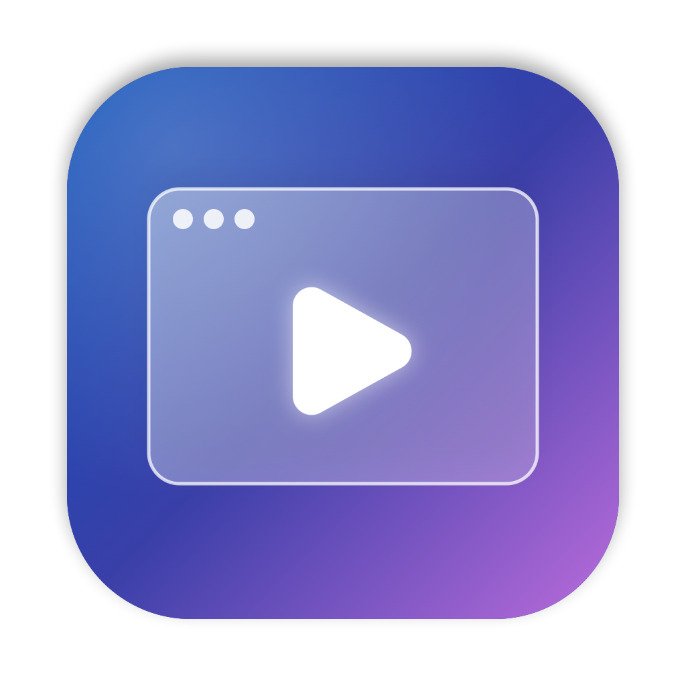
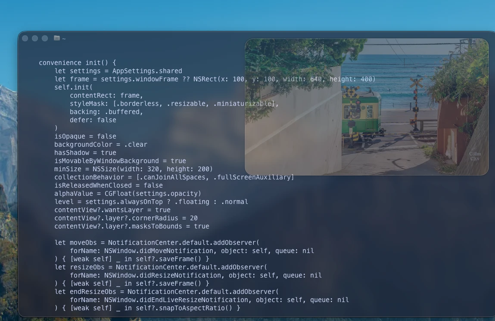

<p align="center">
  
</p>

# GlassPlayer

GlassPlayer is a small macOS app that plays YouTube in a see-through, floating window. You can watch a video in a corner of your screen while you work in other apps.



<sub>Video in screenshot: Calm City on YouTube.</sub>

## Features

- **See-through window:** set the opacity anywhere from 10% to 100%.
- **Always on top:** keep the player above your other windows, or let it sit behind them.
- **Click-through mode:** mouse clicks pass through the player to the app below it.
- **Automatic window shape:** the window changes shape to match the video, including vertical Shorts. It always stays inside the screen.
- **Full-window video:** on a video page, the video fills the whole window. YouTube's header, comments and suggestions are hidden.
- **Stays signed in:** your YouTube sign-in is saved, so you don't need to sign in again after a restart.
- **Playlists:** open a playlist link and the videos play one after another.
- **Menu bar icon:** change the opacity and modes from the menu bar.
- **Control bar:** appears when you move the mouse to the top of the window.

## Requirements

- macOS 14 (Sonoma) or later
- Swift 5.9 or later. You get it with Xcode, or with the Command Line Tools:

  ```bash
  xcode-select --install
  ```

## Install

GlassPlayer isn't available as a download. You build it from the source code:

```bash
git clone https://github.com/seanren/GlassPlayer.git
cd GlassPlayer
./build-app.sh
cp -R GlassPlayer.app /Applications/
```

`build-app.sh` builds the app and creates `GlassPlayer.app` in the project folder. You can also double-click it there to open it without installing it.

To run it straight from the source code for testing:

```bash
swift run
```

## How to use

1. **Open GlassPlayer.** It opens the YouTube home page.
2. **Sign in (optional).** Click *Sign in* on the YouTube page. A sign-in window opens. When you finish, it closes and the player reloads.
3. **Choose a video.** The video fills the window, and the window changes shape to match it.
4. **Move and resize the window.** Drag the top area of the window to move it. Drag an edge or a corner to resize it. When you let go, the window keeps the video's shape.
5. **Change the opacity.** Use the slider in the control bar, press `Cmd` + `=` or `Cmd` + `-`, or choose a value from the menu bar icon.
6. **Use click-through mode.** Turn it on when you want to work in the app behind the player. While it's on, you can't click the player itself. To turn it off, use the menu bar icon, or click GlassPlayer in the Dock.
7. **Open a playlist or video link.** Press `Cmd` + `L` and paste a YouTube link.

### Control bar

Move the mouse to the top of the window to show the control bar. From left to right:

| Button | What it does |
|--------|--------------|
| Close (red) | Closes the window. The app keeps running. Click the Dock icon or choose *Show Player* from the menu bar icon to open it again. |
| Pin | Turns *always on top* on or off. |
| Click-through | Turns click-through mode on or off. |
| Back / Forward | Goes back or forward, like in a web browser. |
| Home | Opens the YouTube home page. |
| Opacity slider | Changes how see-through the window is. |

### Keyboard shortcuts

These work when GlassPlayer is the active app.

| Shortcut | Action |
|----------|--------|
| `Cmd` + `=` | More opaque |
| `Cmd` + `-` | More see-through |
| `Cmd` + `Shift` + `T` | Always on top on/off |
| `Cmd` + `Shift` + `K` | Click-through mode on/off |
| `Cmd` + `[` | Back |
| `Cmd` + `]` | Forward |
| `Cmd` + `Shift` + `H` | YouTube home page |
| `Cmd` + `L` | Open a link |
| `Cmd` + `Q` | Quit |

## Privacy

GlassPlayer doesn't collect or send any data. It only connects to the websites you open in it. Your YouTube sign-in is kept by macOS in the same kind of storage that Safari uses, and your settings (opacity, window position) are saved on your Mac.

## How it works

GlassPlayer is a native Swift app built with AppKit. It shows YouTube in a `WKWebView`, which uses the WebKit engine that comes with macOS, so the app doesn't include its own browser engine.

- The window's `alphaValue` controls the opacity.
- Switching the window level between `.floating` and `.normal` controls *always on top*.
- `ignoresMouseEvents` makes click-through mode work.
- A small script injected into the page makes the video fill the window and reports the video's size, so the window can change shape to match it.
- A persistent `WKWebsiteDataStore` keeps you signed in.

## Disclaimer

GlassPlayer is not made by, supported by or connected to YouTube or Google. YouTube is a trademark of Google LLC. When you use YouTube in GlassPlayer, YouTube's Terms of Service still apply.

YouTube can change its website at any time. If it does, some GlassPlayer features (such as the full-window video) may stop working until the app is updated.

## Licence

GlassPlayer is released under the MIT Licence. See [LICENSE](LICENSE) for details.
